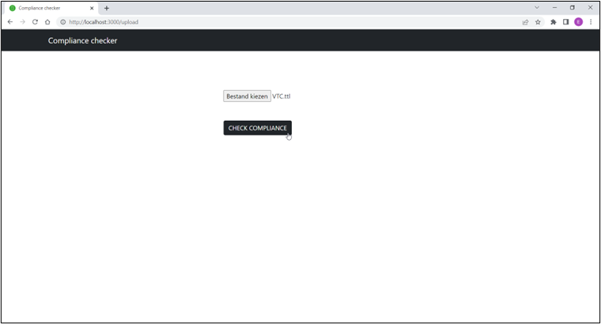

This tool is a proof of concept application of a methodology for compliance checking of building projects, focussing on accessibility.

#Installation
Download the ZIP folder of this repository, or clone it by running `git clone https://github.com/NuytsE/ACC-front` in a terminal.
Do the same for the backend of the application, on 'https://github.com/NuytsE/ACC-back'.

Run `npm install` in both of the folders. Run `npm start` in the frontend folder, and `npm run dev` in the backend folder.

#Use
You can upload a LBD graph of a building project.

slug als je geen LBD hebt staan